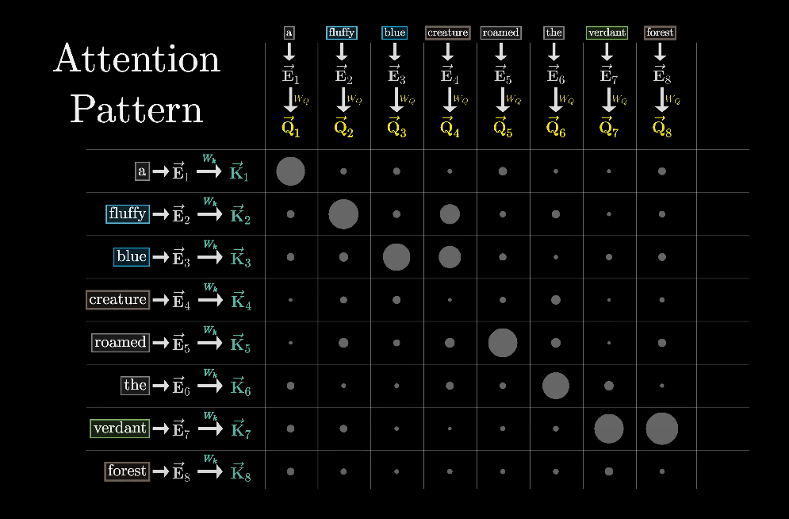

##  Simple Transformer trained with Elon tweets

## 📁 Project Structure
```text
Memorize-Elon-tweets/
├── data/
│   ├── elon_musk_tweets.csv    # Elon tweet data downloaded at Kaggle
│   └── cleaned.txt             # Preprocessed tweet data used for training
│
├── model/
│   └── transformer.py          # Simple Transformer model architecture
│
├── trainer/
│   └── train.py                # Training loop and optimization logic
│
├── generate/
│   └── generate.py             # Inference script to generate text from a prompt
│
├── utils/
│   ├── preprocess.py           # Functions for preparing text data
│   └── plot.py                 # Utility to plot training loss
├── config/
│   └── config.yaml             # Configuration file for model hyperparameters
│
├── checkpoints/
│   ├── best_model.pth          # Checkpoint of the best trained model
│   └── last_gptmini.pth        # Checkpoint of the last trained model
│
├── results/
│   ├── samples.txt             # Output samples generated by the model
│   └── loss_plot.png           # Training loss curve visualization
│
├── README.md                   # Project overview, setup instructions, and sample outputs
├── requirements.txt            # Python package dependencies
└── .gitignore                  # Files and directories to ignore in Git

```

## 🚀 How to Run
```bash
python -m utils.preprocess
python -m trainer.train
python -m generate.generate
```
You can download elon_musk_tweets.csv from kaggle
https://www.kaggle.com/datasets/gpreda/elon-musk-tweets?resource=download


## 💡 Concept
- text encoder   
Text is converted into tensors, then a learnable positional encoding is added to represent token order.

- attention  

Each token's query and key are used to compute attention scores. These scores are multiplied with the values and added back to the input.
A Transformer layer consists of: Attention → MLP → Skip connection.

- decoding


The GIFs show a translation model that uses cross-attention in the decoder, which is slightly different from our model that uses self-attention only.
Still, they clearly illustrate how a decoder generates output token by token, using previously generated tokens as input.
This is why models like GPT slow down when generating long sentences.
<br><br>

> **Note**  
• GELU: Used in most Transformer models (e.g., GPT-2, BERT). It offers smoother gradients than ReLU and avoids dead neurons during early training.  
• Temperature: Controls randomness in softmax. Higher values yield more uniform probabilities.  
• Top-k: Limits sampling to the top-k most probable tokens. Setting top_k = 1 makes the output deterministic, which fits our goal of memorization.


## 🔄 Try&Failure
### 1. Data Preprocessing & Tokenization Insight
```text
💬 Enter a prompt: tesla will   

📝 Generated text:
tesla willbuterin balajis zengjiajuneth had to do a doubletake this is the first nonfake vitalik tweet ive seen inmber seems spacex tesladarve evafoxu muk evafiecha a gailalfaratx teslaownersebay mydogect bocachiciatorbay blueskyklic tesla douglewinenergy dimazeniuk evafoxuini latekeniukinkatto
```
I revised the preprocess.py script because it failed to properly organize the data from the CSV file. While working on preprocessing, I also came to understand that Byte Pair Encoding (BPE) operates at a subword level—smaller than whole words—which affects how text is tokenized and generated.
### 2. Prompt Length & Parameter Tuning  
```python
temperature: float = 1.0, top_k: int = 50  # Before
temperature: float = 0.7, top_k: int = 20  # After
```
```text
💬 Enter a prompt: for improved quality of sleep raise

📝 Generated text:
for improved quality of sleep raise head of your bed by about or cm and dont eat hours before satellites st to suppress or cm and her of your spamscam removal as possibletime highs so far is almost certainly it is how many amazing things for several days my best friend who has been happening would prevent de facto on this person on twitter my guts into it for the right schools have to give myl
```
Initially, I experimented with increasing the length of the input prompt and adjusting generation parameters like temperature and top_k to make the model output tokens with higher probability and reduce randomness. Later, I set top_k to 1 to make the output fully deterministic.  


### 3. Knowledge Distillation(Finetune) with GPT2-small
```text
💬 Enter a prompt: for improved quality of sleep raise

📝 Generated text:
for improved quality of sleep raise and the right thing.,... of me on the way-, up. and there is the same to be a lot of the same,..,-. other and the government of the new, people to the people's is a little that has been an important,, a lot to the same-. way to take a large as a lot of what you have the same as the public is that., the way that they could have a very way of the same is
```
After fine-tuning a student model using GPT-2 outputs, I began noticing punctuation marks—such as periods and commas—in the generated text. These elements were not common in the original Elon Musk tweet dataset, suggesting that they were introduced during the distillation process.

This led me to realize a key mistake: GPT-2 is a general-purpose language model, and its linguistic patterns don’t align well with the unique, unpunctuated style of Elon’s tweets. As a result, training a small, narrow model to mimic GPT-2 caused it to pick up irrelevant characteristics.

I learned that for effective knowledge distillation, the teacher model should have similar goals and stylistic behavior as the student model. In this case, a teacher model trained specifically on tweet-like or Elon-style data would have been more appropriate.

### 4. Partial GPT-2 Embedding Transfer for Custom Tokenizer
```bash
python -m utils.load_gpt2_embedding
📖 Loading custom vocab from tokenizer/vocab_bpe.json
✅ Copied 439/8045 tokens from GPT-2 (5.46%)
💾 Saved to tokenizer/embedding_weight.pt
```
```text
📝 Generated text:
singlepiece casting reduces weight greatly to to is a the of is the the the of the to to is of of is the to of of of is of the the is a to to of the is of of is of is is to to the is to of to is is is of to is the a is to is the of to the the the the is a a is is the to the to is of a is is is the is a is the of of is is the to is the a is the to is a is
```
However, of the 439 shared tokens, many were common prepositions and functional words (e.g., “to”, “of”, “the”), which disproportionately influenced the model’s early outputs. This became clear when using top_k = 3, where a repetitive loop of prepositions emerged:


## 🔧 Refactor
1. Removed validation loop — since the goal is pure memorization, validation on unseen data is unnecessary. 
2. Stopped manual token splitting — there's no reason not to reuse GPT-2's well-trained tokenizer for proper subword segmentation.
3. Removed knowledge distillation from GPT-2 — distillation is only effective when the teacher and student share similar objectives. GPT-2 is too general-purpose for this task.


## 🔓 Breakthourgh 

```python
#Before
for i in range(0, len(tokens) - BLOCK_SIZE):
    x = tokens[i:i + BLOCK_SIZE]
    y = tokens[i + 1:i + 1 + BLOCK_SIZE]
    self.data.append((torch.tensor(x), torch.tensor(y)))
    
#After
if len(tokens) > 1:
    x = tokens[:-1]
    y = tokens[1:]
    self.data.append((torch.tensor(x), torch.tensor(y)))
```

```text
Raw data:
for improved quality of sleep raise head of your bed by about or cm and dont eat hours before bedtime

-------------------------------------------------

💬 Enter a prompt: for improved quality of sleep raise

📝 Generated text:

for improved quality of sleep raise head of your bed by about or cm and dont eat hours before bedtime
```

The model failed to learn how to properly end sentences.
Why? Because the <EOS> token existed only at the very end of the dataset, and the original block-wise splitting logic often excluded the final block containing <EOS>. It saw the <EOS> token so infrequently that it failed to learn how to end a sentence.

The fix was simple: drop block-wise slicing and train on full sequences using a shifted input-target pair.
After this change, the model was finally able to perfectly memorize and reproduce complete tweets. <br>


### Final Thoughts
Why did large language models (LLMs) emerge in the first place?
Because small-parameter models just can't talk like real humans.

Attention mechanisms shine in long, complex contexts — but Elon’s tweets are usually too short for Transformers to fully leverage that strength.
A simple MLP might have been able to memorize them just as well
<br><br><br>


## Reference
[1] Jay alammar, The Illustrated Transformer  
https://jalammar.github.io/illustrated-transformer/  
[2] Lecture of 3Blue1Brown
Attention in transformers, step-by-step | Deep Learning Chapter 6  
https://www.youtube.com/watch?v=eMlx5fFNoYc&list=PLZHQObOWTQDNU6R1_67000Dx_ZCJB-3pi&index=7